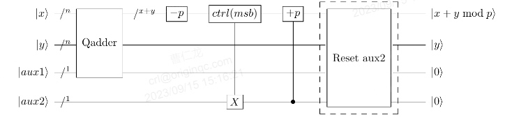

# VarModAdd(qvec1, qvec2, auxadd, aux, N)
## 定义
### 运算公式
|x+y mod N>
### 运算含义
对于两个量子寄存器以及常数N，执行变量模加运算
### 量子线路图
对于两个量子寄存器以及常数p，执行变量模加运算具体线路如下图所示

上图中aux2复位的具体实现如下图所示

## 参数
qlist **qvec1**：操作数x

qlist **qvec2**：操作数y

qubit **auxadd**：用于QAdder和控制常数模加运算的辅助量子位

qubit **aux**：用于QAdder和控制常数模加运算的辅助量子位

int **N**：模数
## 返回值
pq.QCircuit