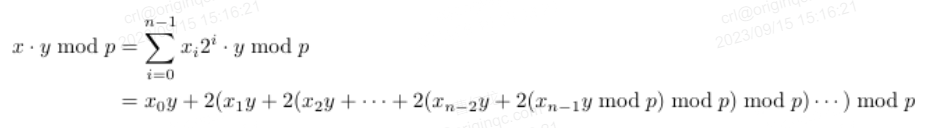
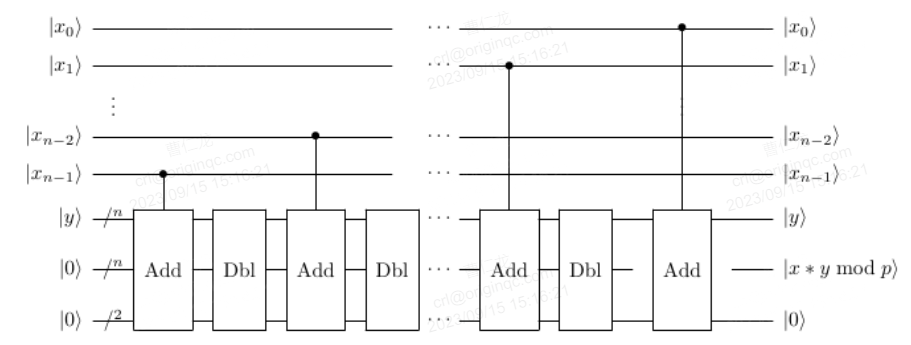

# VarModMul(qvec1, qvec2, qvec3, auxadd, aux, N)
## 定义
### 运算公式
|x>|y>|0>→|x>|y>|x*y mod N>
### 运算含义
对两个量子寄存器|x>、|y>以及常数p,实现|x * y mod p>.基本思想将|x * y mod p>转化为二进制展开式

### 量子线路图

## 参数
qlist **qvec1**：操作数x

qlist **qvec2**：操作数y

qlist **qvec3**：存储运算结果

qubit **auxadd**：用于QAdder和控制常数模加运算的辅助量子位

qubit **aux**：用于QAdder和控制常数模加运算的辅助量子位

int **N**：模数
## 返回值
pq.QCircuit