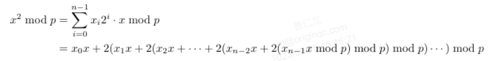
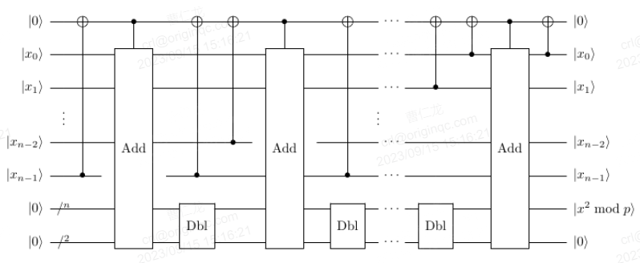

# VarModSqr(qvec1, qvec2, auxadd, aux, auxsqr, N)
## 定义
### 运算公式
|x>→|x^2 mod p>
### 运算含义
对量子寄存器|x>以及常数p，实现|x^2 mod p>。基本思想将x^2 mod p转化为二进制展开式

### 量子线路图

## 参数
qlist **qvec1**：操作数x

qlist **qvec2**：操作数y

qubit **auxadd**：用于QAdder和控制常数模加运算的辅助量子位

qubit **aux**：用于QAdder和控制常数模加运算的辅助量子位

qubit **auxsqr**：用于QAdder和控制常数模加运算的辅助量子位

int **N**：模数
## 返回值
pq.QCircuit