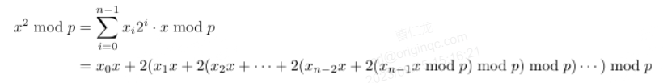

# VarModAdd(qvec1, qvec2, auxadd, aux, N)
## 定义
### 运算公式
|x+y mod N>
### 运算含义
对于两个量子寄存器以及常数N，执行变量模加运算
### 量子线路图
对于两个量子寄存器以及常数p，执行变量模加运算具体线路如下图所示

上图中aux2复位的具体实现如下图所示

## 参数
qlist **qvec1**：操作数x

qlist **qvec2**：操作数y

qubit **auxadd**：用于QAdder和控制常数模加运算的辅助量子位

qubit **aux**：用于QAdder和控制常数模加运算的辅助量子位

int **N**：模数
## 返回值
pq.QCircuit
# VarModNeg(qvec, N)
## 定义
### 运算公式
|-x mod N>
### 运算含义
变量模负运算
### 量子线路图

## 参数
qlist **qvec**：操作数x

int **N**：模数
## 返回值
pq.QCircuit
# VarModDou(qvec, aux, N)
## 定义
### 运算公式
|2x mod N>
### 运算含义
计算变量的二倍模乘运算
### 量子线路图

## 参数
qlist **qvec**：存储操作数x

qubit **aux**：控制常数模加运算的辅助量子位

int **N**：模数
## 返回值
VarModDou.QCircuit
# VarModInv(qvec, N)
## 定义
### 运算公式

### 运算含义
计算带模整数的逆运算
## 参数
qlist **qvec**：存储操作数x

int **N**：模数
## 返回值
pq.QCircuit
# VarModMul(qvec1, qvec2, qvec3, auxadd, aux, N)
## 定义
### 运算公式
|x>|y>|0>→|x>|y>|x*y mod N>
### 运算含义
对两个量子寄存器|x>、|y>以及常数p,实现|x * y mod p>.基本思想将|x * y mod p>转化为二进制展开式

### 量子线路图

## 参数
qlist **qvec1**：操作数x

qlist **qvec2**：操作数y

qlist **qvec3**：存储运算结果

qubit **auxadd**：用于QAdder和控制常数模加运算的辅助量子位

qubit **aux**：用于QAdder和控制常数模加运算的辅助量子位

int **N**：模数
## 返回值
pq.QCircuit
# VarModSqr(qvec1, qvec2, auxadd, aux, auxsqr, N)
## 定义
### 运算公式
|x>→|x^2 mod p>
### 运算含义
对量子寄存器|x>以及常数p，实现|x^2 mod p>。基本思想将x^2 mod p转化为二进制展开式

### 量子线路图

## 参数
qlist **qvec1**：操作数x

qlist **qvec2**：操作数y

qubit **auxadd**：用于QAdder和控制常数模加运算的辅助量子位

qubit **aux**：用于QAdder和控制常数模加运算的辅助量子位

qubit **auxsqr**：用于QAdder和控制常数模加运算的辅助量子位

int **N**：模数
## 返回值
pq.QCircuit