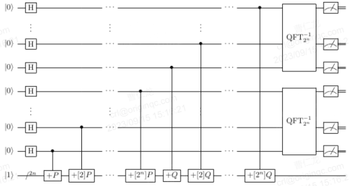

# shor_ecdlp(p, a, b, P, Q)
## 定义
### 算法含义
量子虚拟机下shor算法求解椭圆曲线离散对数运算
### 量子线路图
Shor算法求解ECDLP的关键技术是设计椭圆曲线点加量子线路，如下图所示。

### 算法原理

## 参数
int **p** **a** **b**:椭圆曲线参数
vector **P** **Q**：椭圆曲线上的不同点
## 返回值
椭圆曲线离散对数求解P和Q的算法结果