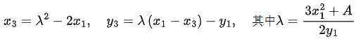
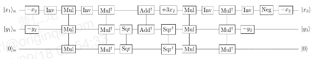

# Q_EpADD(vx1,vy1,x2,y2,p,n2)
## 定义
### 运算含义
椭圆曲线受控点加运算
### 运算公式
E/F_p：定义在有限域F_p上的椭圆曲线,P∈E(F_p)是阶为r的循环加法群。

Q∈P,求解m∈Z_r,使得Q=[m]P。

椭圆曲线点加计算公式：

设椭圆曲线E/F_p:y^2=x^3+A x+B上两个点P_1=(x_1, y_1),P_2=(x_2, y_2)
如下定义一个新点P_3，设通过P_1和P_2的直线L，L与E相交于第三个点P_3’，
作P_3’关于x-轴的对称点(即改变y-坐标的符号)，得到点P_3，具体可见下图。
这里定义P_1+P_2=P_3

下面给出加法公式：

设E, P_1=(x_1, y_1), P_2=(x_2, y_2) 如上所示，P_1, P_2≠O。 定义P_1+P_2=P_3=(x_3, y_3)：
	若x_1≠x_2，则

若x_1=x_2，但y_1=y_2，则
P_1+P_2=O。

若P_1=P_2和y_1≠0，则

若P_1=P_2和y_1=0，则P_1+P_2=O。
此外，对于E上的所有点P，定义P+O=P。
### 量子线路图

## 参数
int **p** **x2** **y2**:椭圆曲线参数

qlist **vx1** **vy1**:n2量子比特数组

int **n2**:ceil(log(p, 2))+1
## 返回值
量子虚拟机下椭圆曲线受控点加运算模拟值

# q_elliptic_padd(p,a,b,P,Q)
## 定义
### 运算公式
P+Q P,Q∈E/F_p:y^2 = x^3+ax+b
### 运算含义
素数域上椭圆曲线点加运算
### 量子线路图

## 参数
int **p** **a** **b**:椭圆曲线参数

vector **P** **Q**：椭圆曲线上的不同点
## 返回值
P+Q的坐标（x，y）的量子态

# C_ecdlp(p, a, b, P, Q)
## 定义
### 运算含义
ECDLP(椭圆曲线离散对数问题):
设E/Fp是一条椭圆曲线，其上的有理点P形成一个k阶加法群G,若Q∈G且Q=mP，求m mod k。

ECC（椭圆曲线密码体制）：包括椭圆曲线加密算法、椭圆曲线密钥协商协议、椭圆曲线数字签名协议。其算法安全性基于ECDLP。
本篇中的所有p为奇素数且n=|log p|。
## 参数
int **p** **a** **b**:椭圆曲线参数

vector **P** **Q**：椭圆曲线上的不同点
## 返回值
P与Q的倍数

# C_Epadd(a, b, p, P, Q)
## 定义
经典计算机下椭圆曲线仿射坐标系下加法运算
## 参数
int **p** **a** **b**:椭圆曲线参数

vector **P** **Q**：椭圆曲线上的不同点
## 返回值
椭圆曲线仿射坐标系下加法计算结果

# Ct_PointADD(vx1,vy1,x2,y2,p,n2,ctrl)
## 定义
椭圆曲线控制点加运算
## 参数
int **p** **x2** **y2**:椭圆曲线参数

qlist **vx1** **vy1**:n2量子比特数组

int **n2**:ceil(log(p, 2))+1

vector **P** **Q**：椭圆曲线上的不同点

qubit **ctrl**：控制辅助量子比特
## 返回值
椭圆曲线控制点加运算计算结果

# q_elliptic_pdou(p, a, b, P)
## 定义
椭圆曲线二倍点运算
## 参数
int **p** **a** **b**:椭圆曲线参数

**P**：椭圆曲线上的一个点

## 返回值
椭圆曲线二倍点运算计算结果

# Q_EpDOU(vx1,vy1,a,b,x,y,p,n2)
## 定义
椭圆曲线二倍点运算
## 参数
int **p** **a** **b**:椭圆曲线参数

int **x** **y**:椭圆曲线上一个点的坐标

qlist **vx1** **vy1**:n2量子比特数组

int **n2**:ceil(log(p, 2))+1
## 返回值
椭圆曲线二倍点运算计算结果

# qinverse(q,p)
## 定义
量子虚拟机下模p求逆运算
## 参数
int **p**:模数

int **q**：操作数
## 返回值
量子虚拟机下模p求逆运算计算结果
