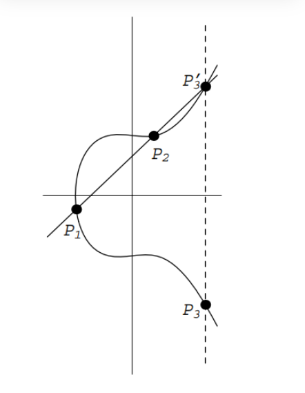
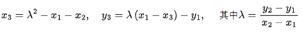
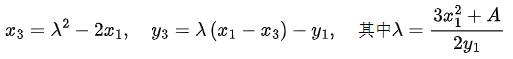

# Q_EpADD(vx1,vy1,x2,y2,p,n2)
## 定义
### 运算含义
椭圆曲线受控点加运算
### 运算公式
E/F_p：定义在有限域F_p上的椭圆曲线,P∈E(F_p)是阶为r的循环加法群。

Q∈P,求解m∈Z_r,使得Q=[m]P。

椭圆曲线点加计算公式：

设椭圆曲线E/F_p:y^2=x^3+A x+B上两个点P_1=(x_1, y_1),P_2=(x_2, y_2)
如下定义一个新点P_3，设通过P_1和P_2的直线L，L与E相交于第三个点P_3’，
作P_3’关于x-轴的对称点(即改变y-坐标的符号)，得到点P_3，具体可见下图。
这里定义P_1+P_2=P_3

下面给出加法公式：

设E, P_1=(x_1, y_1), P_2=(x_2, y_2) 如上所示，P_1, P_2≠O。 定义P_1+P_2=P_3=(x_3, y_3)：
	若x_1≠x_2，则

若x_1=x_2，但y_1=y_2，则
P_1+P_2=O。

若P_1=P_2和y_1≠0，则

若P_1=P_2和y_1=0，则P_1+P_2=O。
此外，对于E上的所有点P，定义P+O=P。
### 量子线路图

## 参数
int **p** **x2** **y2**:椭圆曲线参数

qlist **vx1** **vy1**:n2量子比特数组

int **n2**:ceil(log(p, 2))+1
## 返回值
量子虚拟机下椭圆曲线受控点加运算模拟值