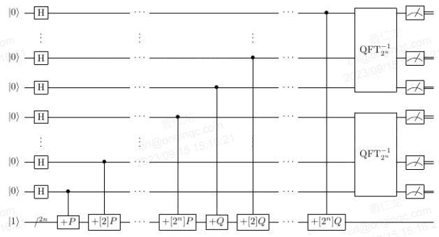

# 介绍
Shor算法求解ECDLP的关键技术是设计椭圆曲线点加量子线路，如下图所示。

(一) 针对椭圆曲线点加量子线路的线路设计，所需的底层组件主要包括常数模加模乘、变量模加模乘模平方、变量模逆模取负等，各基本运算组件参考【基本运算】章节。
这几个线路在计算点加过程中是占用资源较大的几个。
# 背景
1994年，Peter Shor提出了著名的Shor算法，可以求解交换群上的隐藏子群问题。
该算法充分利用了量子计算的叠加性以及纠缠性的特点，
能够在多项式时间复杂度内完成大整数分解和离散对数问题（包括椭圆曲线离散对数问题），
对传统公钥密码算法造成强大的威胁。Shor算法的提出极大地促进了量子计算的发展，
也是量子算法首次在经典算法关注领域取得突破。

1995年，Robert B. Griffiths和Chi-Sheng Niu设计了Semiclassical_Shor算法，
目的是为了节省量子比特数。

2003年之后，一些研究者们开始研究了Shor算法求解椭圆曲线离散对数问题的重点难点和估计了量子计算资源。

# 安全性
1994年，Shor提出量子多项式时间算法求解整数分解问题以及离散对数问题，随后一些研究者将其推广到求解椭圆曲线离散对数问题。
# 应用场景
Semiclassical_Shor算法可以在量子比特数受限的情况下，
实现比原始Shor算法更大规模的整数分解或者离散对数求解或者椭圆曲线离散对数问题求解等数学问题。

A. Yimsiriwattana and S.J. Lomonaco (2004)提出分布式的Shor算法。
所以，在NISQ时代，实现Semiclassical_Shor算法是相当重要的。
之后，Ligang Xiao等（2023）结合分布式Shor算法、Semiclassical_Shor算法和量子EPR，进一步优化的分布量子计算机的计算资源。

ECC在数字货币、手机芯片、微信APP、银行卡以及银行系统中都有广泛的应用。研究Shor算法或Semiclassical_Shor算法求解ECDLP，
对公钥密码体制的量子攻击分析至关重要。首先，在一定的量子硬件水平下，我们需要实现Shor算法攻击ECDLP的量子线路，
验证其正确性，分析其成功概率。之后，我们需要在实现的基础上继续做优化与改进。在研究范畴，实现与验证算法的正确性是第一步的，
后续也有助于进一步研究；在工程范畴，可以很好地体现了量子计算的优势。总体上来说，利用量子算法分析公钥密码安全，
也在不断警示着，后量子密码需积极部署与迁移。
# 国内外现状
微软、谷歌、IBM、KTH 皇家理工学院的Ekerå团队等研究团队做了一些较深入的研究。

2013年，John Proos, Christof Zalka等人的工作，文中考虑素数域上的ECDLP。
在此基础上，文献给出了算法所需的逻辑量子比特数约为6n，其中n为密钥长度。

2017年，Martin Roetteler, Michael Naehrig等人
给出了Shor算法攻击ECDLP的量子资源精确估计。2020年，Thomas Häner, Samuel Jaques等人通过“置换”总比特数、线路深度与T门数量，
改进了针对椭圆曲线的Shor算法线路中的标量乘法模块，使之相较之前的线路有更短的线路深度和更少的T门数量。
并且，作者还在具体的量子编程语言实现了点加模块以验证改进的正确性。

2017年，Martin Roetteler, Michael Naehrig等人
给出了Shor算法攻击ECDLP的量子资源精确估计。2020年，Thomas Häner, Samuel Jaques等人通过“置换”总比特数、线
路深度与T门数量，改进了针对椭圆曲线的Shor算法线路中的标量乘法模块，使之相较之前的线路有更短的线路深度和更少的T门数量。
并且，作者还在具体的量子编程语言实现了点加模块以验证改进的正确性。
